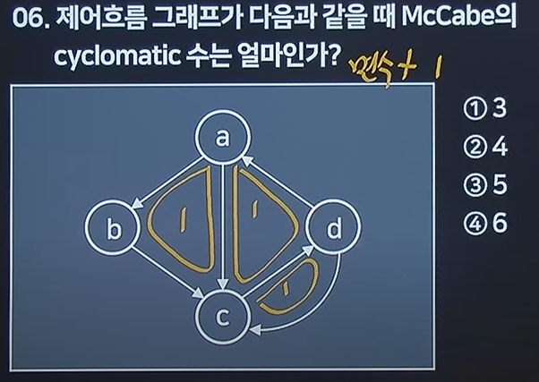
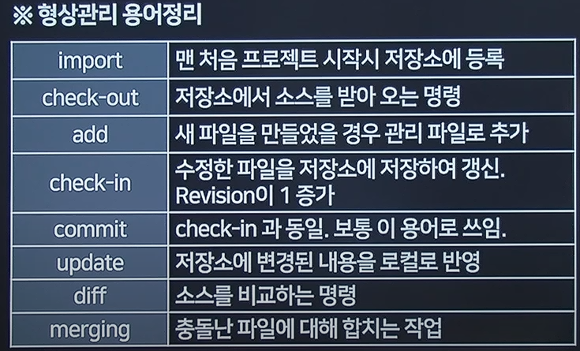
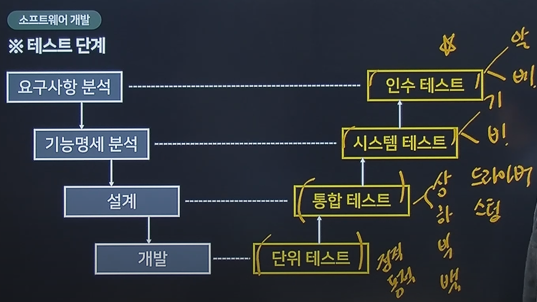

1. 트리 운행법

- 전위 pre 부모가 먼저
- 중위 In 부모가 2번째
- 후위 post 부모가 마지막

2. 인터페이스 보안을 위해 네트워크 영역에 적용될수 있는솔루션

- SMTP

3. 소프트웨어 형상관리 역할

- 소스를 효율적으로 관리할 수 있다.

4. 소프트웨어 패키징 도구 활용 고려사항

- 제품 소프트웨어의 종류에 적합한 암호화 알고리즘 고려
- 추가로 다양한 이기종 연동 고려
- 사용자 편의성을 위해 복잡성 및 비효율성문제 고려

5. 정렬 문제

6. 제어흐름 그래프 McCabe,cyclomatic 수

- 면수 +1을 해야한다.
  

7. 형상관리 도구의 주요 기능

8. 트리의 차수 가장많은 자식

9. 알파 베타 테스트와 밀접한 연관이 있는 테스트는 인수 테스트

- 

10. 클린 코드 작성원칙

11. 디지털 저작권 관리 기술

- 콘텐츠 암호화 및 키 관리
- 콘텐츠 식별체계
- 라이센스 발급 및 관리

12. 소프트 웨어 재공학이 소프트웨어의 재개발에 비해 갖는 장점

- 3R이 있다.
- 역공학
- 재공학
- 재사용
- 위험부담 감소
- 비용 절감
- 시스템명세의 오류 억제

13. 소프트웨어 품질 목표중 주어진 시간동안 주어진 기능을 오류없이 수행하는 정도는

- 정확성 : 요구사항을 만족
- 신뢰성 : 기능상 장애 없이
- 효율성 : 시스템 자원과 코드량의 최적화
- 무결성 : 허가받은 사람만 사용
- 사용용이성 : 배우는데 요구되는 노력 최소화
- 유지보수성 : 프로그램의 오류를 발경하고 수정하는데 용이성
- 이식성 : 다른 환경으로 이전하는데 요구되는 노력
- 재사용성 : 소프트웨어 일부를 다른 시스템에서 재사용할 수 있어야함

14. 소프트웨어 공학의 기본 원칙은?

- 품질 높은 소프트웨어 개발
- 지속적인 검증 시행
- 경과에 대한 명확한 기록 유지

15. 인터페이스 구형시 사용되는건 js통신기술은 ajax다

16. 블랙박스 테스트 유형

- 오류 예측
- 경계값 분석
- 동등 분할 기번

17. 패키지 소프트웨어의 일반적인 제품품질 요구사항 및 테스트를 위한 국제 표준은

- ISO/IEC 12119

18. 스텁은 하향식 테스트이다.

- 상향식은 드라이브
- 회귀는 수정되면 다시
- 빅뱅은 전부 다 테스트

19. 물리데이터 저장소의 분할기법이 아닌것

- 파티션은 테이블 또는 인덱스 등을 나누어 둔 단위
- 장점
  - 데이터 엑세스 범위 줄여 성능향상
  - 파티션별로 데이터가 분산되어 디스크 성능 향상
  - 파티션별 백업 및 복구 속도 향상
  - 시스템 장애시 데이터 손상정도 최소화
- 단점
  - 하나의 테이블을 세분화하여 관리하므로 관리비 많이나옴
  - 테이블간 조인에 대한 비용 증가
- 종류
  - 범위 분할
  - 해시 분할
  - 조합 분할

20. 알고리즘 설계 기법

- 분할 정복법(Divide and Conquer)
  - 병합정렬, 2진탐색
- 동적 계획법(dynamic programming)
  - 플로이드 알고리즘
- 탐욕법 (Greedy)
  - Dijkstra (가장 해결하기 쉬운것부터)
- 백트래킹법 (Backtracking)
  - 깊이우선 탐색 알고리즘 (미로찾기)
- 근사해법 (approximation)
  - 최적해에 가까운 근사해를 구하는 알고리즘
