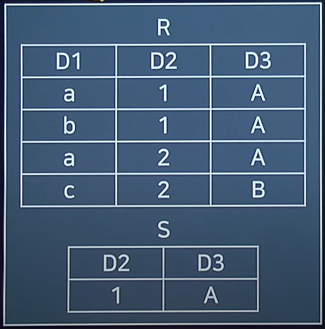
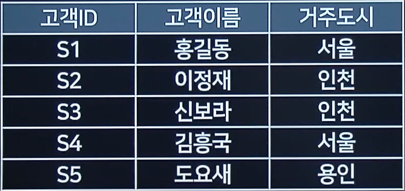

1. Division 연산의 수행결과

- 관계연산자 (순수관계)
  > 
- R에 있는것들 중에 s에 있는게 다있는 항목
- d2 d3의 값은 빠진다.

2. 릴레이션 정규화 작업 (도 부 이 결 다 조)

- 정규화 과정을 확인해야 한다.
- 개념 논리 물리
- 1nf - 도메인 원자값 (1대 다로 물리는것)
- 2nf - 부분함수 종속 (하나의 테이블을 두개로 쪼갠다.)
- 3nf - 이행적 (x->y->z = x->z)
- bcnf - 결정권가 후보키가 아닌것
- 4nf - 다치
- 5nf - 조인

3. 분산 데이터 베이스의 투명성 (위분지중병장)

- cdn서비스에서 많이 이용함
- 나는 몰라도 된다.
- location 위치 투명성
- division 분할
- local mapping 지역사상
- replication 중복
- concurrency 병행
- failure 장애

4. 릴레이션 조작시 데이터 중복

- 삽입 삭제 중복이상이 일어나기 때문에 정규화함
- anomaly

5. 관계형 데이터 모델
   > 

- relation 은 테이블
- attribute 속성
- tuple 로우
- cardinality 로우갯수

6. 테이블 SQL문

- between은 and밖에 올 수 없다.
- Select \* , A,B
- From table명
- Where -> and | or
- Group by 컬럼(기준값) ( count avg,min,max)
- having (count\*10)
- order by 컬럼 desc asc

7. 함수종속의 추론규칙은

- x->y y->z x->z인건 이행규칙이다.

8. 무결성 제약조건 중 키값 속성이 null인건

- 개체 무결성 : null일수 없다.
- 참조 무결성 : 참조값이 null일 수 없다.
- 속성
- 키
- 사용자 정의
- 도메인

9. DCL명령어가 아닌것은

- SELECT

10. 릴레이션 설명

- 튜플들의 삽입 삭제 등의 작업으로 인해 릴레이션은 시간에 따라 변함
- 튜플에 순서가의미 없다.

11. 도부이결다조

- 결정권자 bcnf (보이스/ 코드 정규화)

12. sql실행문

- disinct는 중복을 제거하고 가져오는 명령어

13. dml은 insert update select delete만 있음

14. 정규화의 목적

- 릴레이션 데이터베이스 내에 표현 가능
- 데이터 삽입시 릴레이션재구성 필요없음

15. commit rollback의 특성

- 모두 동시에 일어나야 하기 때문에
- 원자성 (Atomicity)
- 일관성 (consistency)
- 독립성 (Isolation)
- 영속성 (Durablility)

16. 로킹과 오버해드의 특성을 알아야 한다.

17. 관계대수 순수관계 연산자.

- 순수관계 연산자
  - select
  - division
  - project
- 일반집합 연산자
  - 합집합
  - 교집합
  - 차집합
  - 카티션 프로젝트

18. 뷰의 장점(가상의 테이블)

- 3단계 스키마
- 외부 : 구조를 보는것
  - (논리적)
- 개념 : db의 전체적 관리
  - (물리적)
- 내부 : 안의 속성이 어떤값인지

- 뷰는 논리적 독립성을 가짐
- 인덱스가 없음
- 데이터 보안 용이
- 사용자 데이터 관리 용이
- create drop 사용가능

19. 데이터베이스 로그를 필요로 하는 회복 기법은?

- 즉시 갱신 기법
  - 트랜잭션이 실행 상태에서 변경되는 내용을 그때변경
  - 변경되는 모든 내용은 로그에 기록
  - redo,undo모두 수행
- 회복기법
  - 지연갱신 기법
    - undo없이redo만 수행
  - 검사시점 기법
  - 그림자 페이징 기법

20. sql의 집계함수가 아닌것
