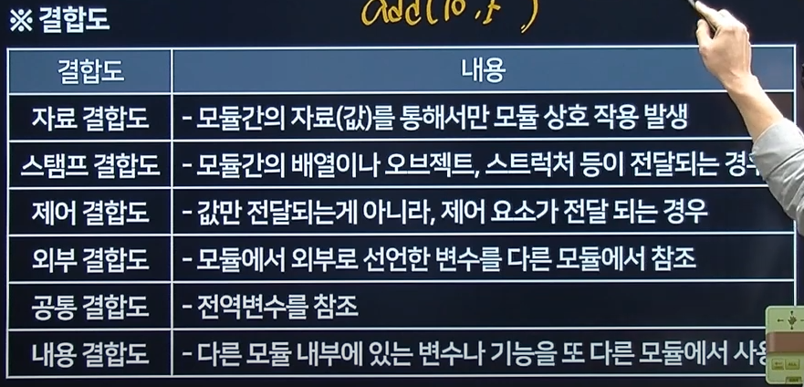

1. C언어의 정수 자료형

- bool
- char
- string
- 정수 : int,long,unsigned
- 부동소수점 : float,double

2. c언어 for문

3. UNIX 명령어

- 새로운 프로세스를 생성하는 명령어는 fork

4. osi-7계층

- 응용 계층
  - 정의 : 사용자와 네트워크간의 응용서비스 연결, 데이터 생성
  - 프로토콜 : (HTTP,TELNET,DHCP,DNS,FTP,SSH,SMTP,SNMP)
  - 단위 : Data
- 표현 계층
  - 정의 : 데이터의 형식 설정과 부호 교환,암호화,해독
  - 프로토콜 : MIME,TLS,SSL,JPEG,MPEG,SMB,AFP
  - 단위 : Data
- 세션 계층
  - 정의 : 응용 프로세스 간의 연결 접속 및 동기 제어
  - 프로토콜 : SSH,TLS,RPC
  - 단위 : Data
- 전송 계층
  - 정의 : 양종단간 신뢰성 있는 정보
  - 프로토콜 : TCP(3 way handshaking),UDP)
  - 단위 :segment
- 네트워크 계층
  - 단말간 시스템끼리 Data를 전송하기 위한 최선의 통신 경로 선택
  - 프로토콜 : IP,**ARP**,ICMP,IGMP,**RARP**,RIP
  - 단위 Packet (장비 : 라우터)
- 데이터링크 계층
  - 정의 : 인접 시스템 간의 데이터 전송, 전송오류 제어 (노드간)
  - 프로토콜 : Ethernet , ATM ,PPL
  - 단위 : frame ,장비: (스위치 브리지)
- 물리 계층
  - 통신회선으로 Data를 나타내는 0과 1비트의 정보를 회선에 내보내기 위한 전기적 변환
  - 프로토콜 : RS-232,X25/21
  - 단위 : Bit 장비 : (허브,리피터)

5. 결합도, 응집도 테스형

- 응집도 기능이 뭉처야함
- 결합도
- 

6. 계산
7. 소프트웨어 취약점

- 버퍼 오버플로
  - 메모리 오류가 발생하여 잘못된 동작을 하는 취약점

32분 까지 봄
