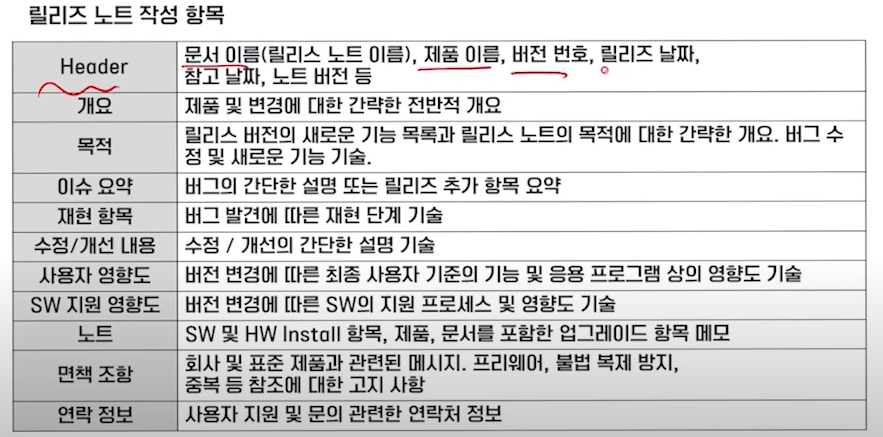
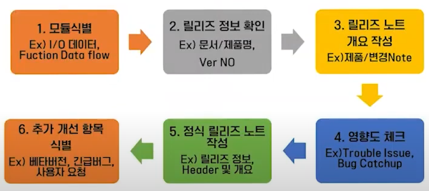
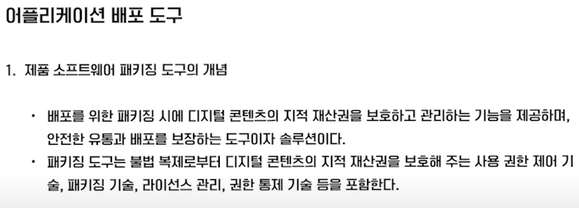
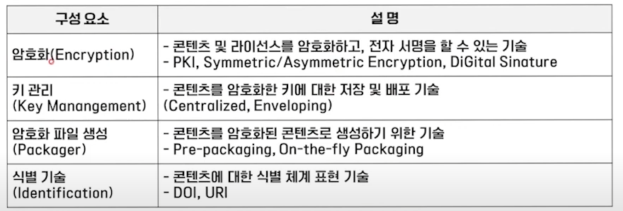
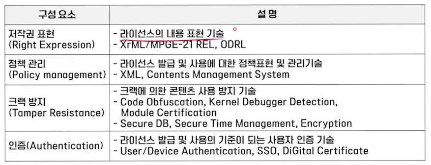
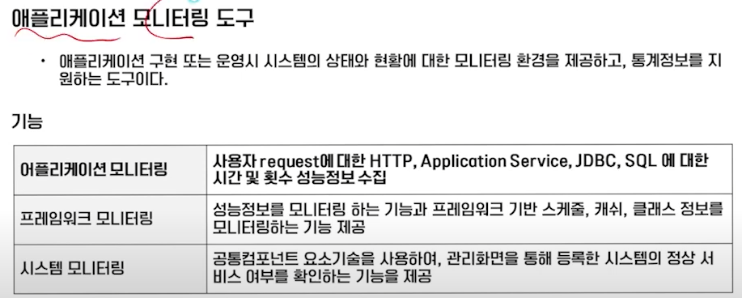
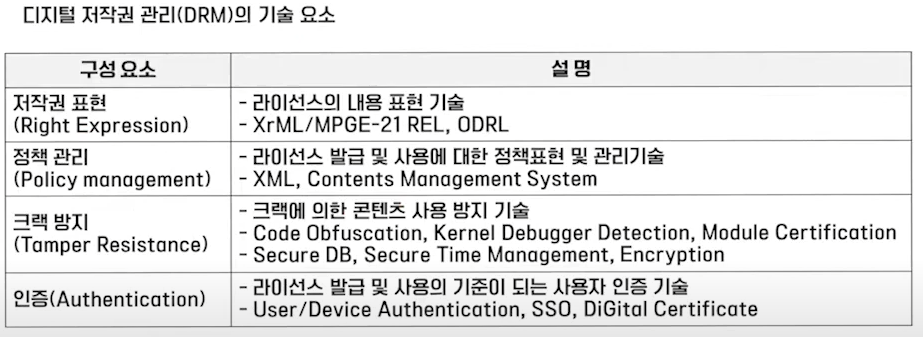
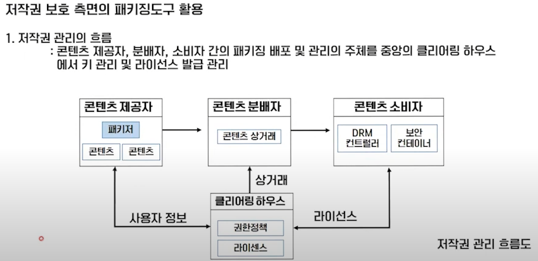

# 제품 소프트웨어 패키징

- 개발이 완료된 제품 소프트웨어를 고객에게 전달하기 위한 형태로 패키징하고
- 설치와 사용에 필요한 재반 절차 및 환경 등 전체 내용을 포함하는 메뉴얼을 작성하고
- 제품 소프트웨어에 대한 패치개발
- 업그레이드를 위한 버전 관리
- 개발자가 아닌 사용자 중심

## 사용자 중심의 패키징 작업 이해

1. 사용자 실행 환경의 이해
   - 사용자 실행 환경을 우선 고려
   - OS,실행환경,시스템사양 및 고객의 사용방법
   - 여러가지 실행 환경이 나오게 된다면 해당 경우에 맞는 배포본을 분류
2. 사용자 관점에서의 패키징 고려사항
   1. 사용자 시스템 환경 즉, OS CPU메모리 등의 수행 최소 환경을 정의
   2. 사용자가 직관적으로 확인할수 있는 UI를 제공하고 메뉴얼과 일치시킨다.
   3. 제품 소프트웨어는 하드웨어와 함꼐 통합 적용될 수 있도록 패키징은 Managed Service형태로 제공되는 것이 좋다.
   4. 다양한 사용자의 요구사항을 반영하기 위 해 변경및 개선 관리를 고려한다.

## 패키징 수행 순서

1. 기능식별
2. 모듈화
3. 빌드
4. 패키징 변경 개선
5. 패키징 적용 시험
6. 사용자 환경 분석

## 릴리즈 노트 작성

### 개념

- 릴리즈 노트는 최종 사용자인 고객과 잘 정리된 릴리즈 문서를 공유
- 상세 서비스를 포함하여 정보들은 철저하게 테스트를 진행하고 최종 승인된 후 배포

### 중요성

1. 테스트 결과가 포함된
2. 확실한 정보제공
3. 제품의 수행 기능 및 서비스의 변화를 공유
4. 전체적인 버전 관리 및 릴리즈 정보를 체계적으로 관리할 수 있다.

### 작성 항목

>  

### 릴리즈 노트 작성 순서

>  

## 어플리 케이션 배포 도구

>  

### 패키징 도구 활용 시 고려 사항

1. 반드시 암호화 보안을 고려한다.
2. 추가로 다양한 이기종 연동을 고려한다.
3. 사용자 편의성을 위한 복잡성 및 비 효율성 문제를 고려한다.
4. 제품 소프트웨어의 종류에 적합한 암호화 알고리즘을 적용한다.

### 패키징 도구 구성요소

>  

>  

## 어플리케이션 모니터링 도구

>  

## 제품 소프트웨어 저작권 관리(DRM)

### 저작권 보호 기술의 필요성

- 배포된 제품 소프트웨어의 무한 복제가 가능하고 원본과 복사본이 동일하게 배포될 특성을 가짐
- 제품 소프트웨어가 상용으로 배포되면 다양한 부가 가치를 가질 수 있는 상품으로 바뀜에 따라 패키징 시에 원작자에 대한 권리 보호 우선 필요

### DRM이란?

- Digital Rights Management
- 디지털 환경에서 콘텐츠를 만들어낸 이의 지적 재산권 보호와 그리고 그 창작물을 사용하고자 하는 사용자의 의무와 권리를 보호하기 위한 기술

### DRM구성요소

>  

### 저작권 보호 측명의 패키징 도구 활용

>  

### 저작권 관리 구성 요소

- 콘텐츠 제공자 : 콘텐츠를 제공하는 저작권자
- 콘텐츠 분배자 - 쇼핑몰 등으로써 암호화된 콘텐츠 제공
- 패키저 - 콘텐츠를 메타 데이터와 함꼐 배포가능한 단위로 묶는 기능
- 보안 컨테이너 - 원본을 안전하게 유통하기 위한 전자적 보안장치
- DRM컨트롤러 - 배포된 콘텐츠의 이용 권한을 통제
- 클리어링 하우스 - 키관리 및 라이센스 발근 관리
